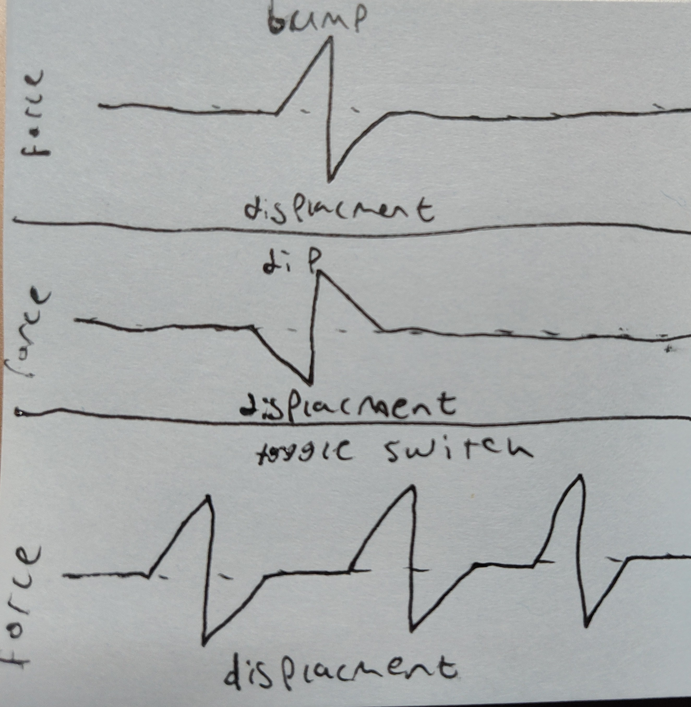
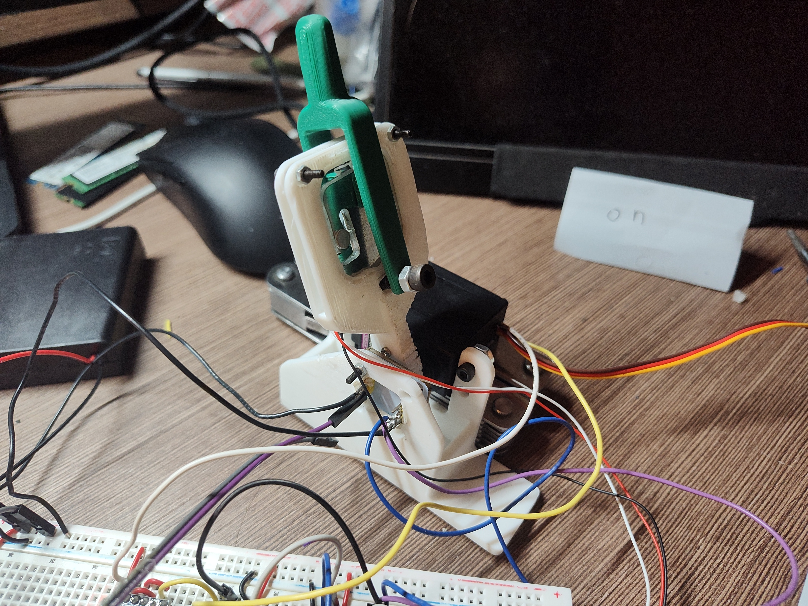
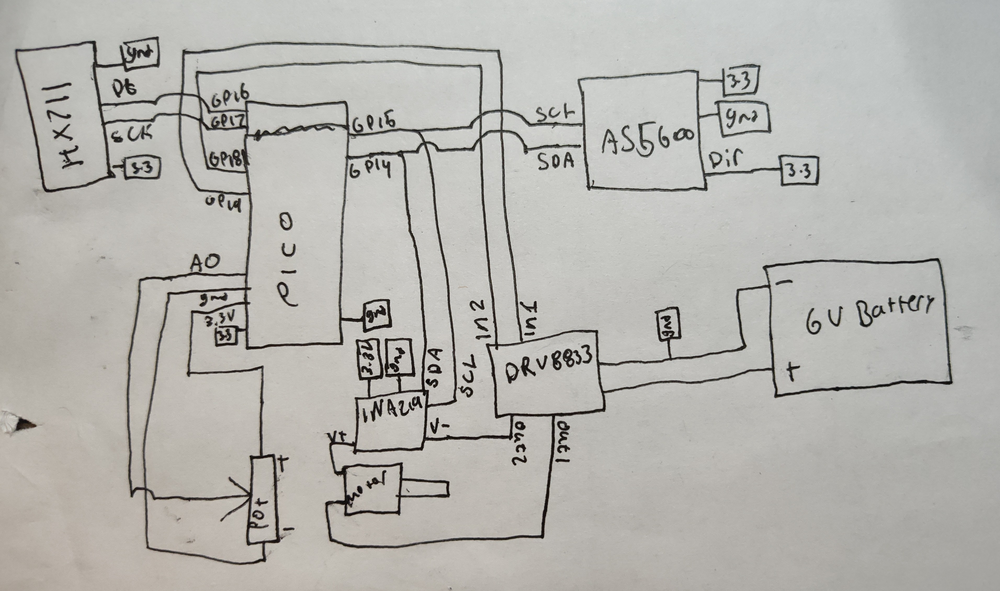

# TITle  
---  
## What haptic feedback should look like  
---
1. For bump style haptic feedback, it should push you away from the bump as you approach, and then after a threshold, to should instead force you the other way off the bump.  
2. A dip should be doing the exact opposite. It should pull you into the dip and mave it hard to leave the threshold value.
3. A toggle switch is basically many bumps next to each other, so theres certain stable areas you can click through as you move the handle

vvv All three are implemented below vvv
---
## Parts used  
---
Starting out, I was having issues with connectivity between the Pico and STM32 boards, and becasue a already had many of the library files writtin for the pico (some from ME333) I used only the pico for this.  
  
For this printed files, I used the 3D print example files from Prof. Marchuck except the arm piece was edited to change how it mounts and a place to add a metal nut inside for screwing the thimble to was added.  

 I did not get to redesigning all of the parts, but that likely would have involved a redesign of the thimble to sit on one side of the load cell and clip onto its tab. I also likely would remove the AS5600  
 encoder entirely as it increases mounting difficulty, and using one chip, having the AS5600 and the potentiometer is a bit redundant.  
---
## Circuit diagram
---

Functionally, the code reads the angle to decide where oon the displacement curve it lies, then uses either the force sensor or  
current sensor (or both) to determine which way the user is pushing, and then attempts to change the feel of this pushing.

angle -> force reading -> current level -> pwm set (inside controller)  

which repeats.  

---
## Haptic modes:
---
A haptic assist mode:  
(works by actively pushing motor in the direction the person is pushing so that the arm feels effortless to push)  
This code has weird jitters in one direction but feels perfectly smooth in the other    
```c
// Haptic assist
if(fabs(grams)>60){
                bool dir = false; // right
                if(grams<0) dir = true;

                float bgrams = fabs(grams);
                bgrams-=60;

                bgrams*=0.005;

                if(!dir) {
                    bgrams*=-0.7;
                }

                set_duty_cycle(bgrams);
            }
            else{
                set_duty_cycle(0);
            }
```

I tried getting control to use current(correct) and not pwm(inaccurate), as  
current is the correct value for setting force, but some amount  
of noise or coding errors resulted in an unresolved error where it shoots the  
whole paddle in a direction while sitting untouched.  

```c
// interrupt change for that:
// the while loop set a volatile desired current value instead of setting pwm
actual_current = read_ina219();

    float error = desired_current - actual_current;

    eint += error * 0.001f;

    float u = kp*error + ki*eint;

    if(desired_current==0){
        set_duty_cycle(0);
    }
    else{
        set_duty_cycle(-u);
    }
```

Going back to pwm control:  
This adds a bump haptic effect:  

```c
// the else condition is the haptic assist
if(angle<110&&angle>105){
    if(fabs(grams)>50){
        set_duty_cycle(0.4);

    }
    else{
        set_duty_cycle(0);
    }
}
else if(angle<115&&angle>110){
    if(fabs(grams)>50){
        set_duty_cycle(-0.2);
    }
    else{
        set_duty_cycle(0);
    }
}
```

A dip haptic effect:
```c
if(angle<110&&angle>100){
    if(fabs(grams)>50){
        set_duty_cycle(0.4);

    }
    else{
        set_duty_cycle(0);
    }
}
else if(angle<120&&angle>110){
    if(fabs(grams)>50){
        set_duty_cycle(-0.2);
    }
    else{
        set_duty_cycle(0);
    }
}
```

And a toggle switch:
```c
if(angle<80&&angle>75){
    if(fabs(grams)>50){
        set_duty_cycle(-0.4);

    }
    else{
        set_duty_cycle(0);
    }
}
else if(angle<85&&angle>80){
    if(fabs(grams)>50){
        set_duty_cycle(0.2);
    }
    else{
        set_duty_cycle(0);
    }
}
else if(angle<135&&angle>130){
    if(fabs(grams)>50){
        set_duty_cycle(-0.4);
    }
    else{
        set_duty_cycle(0);
    }
}
else if(angle<140&&angle>135){
    if(fabs(grams)>50){
        set_duty_cycle(0.2);
    }
    else{
        set_duty_cycle(0);
    }
}
```