# DSP in Python
---
1. Getting data out of csv:
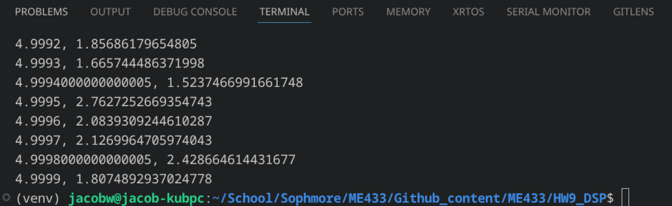
2. Plotting data in matplotlib:
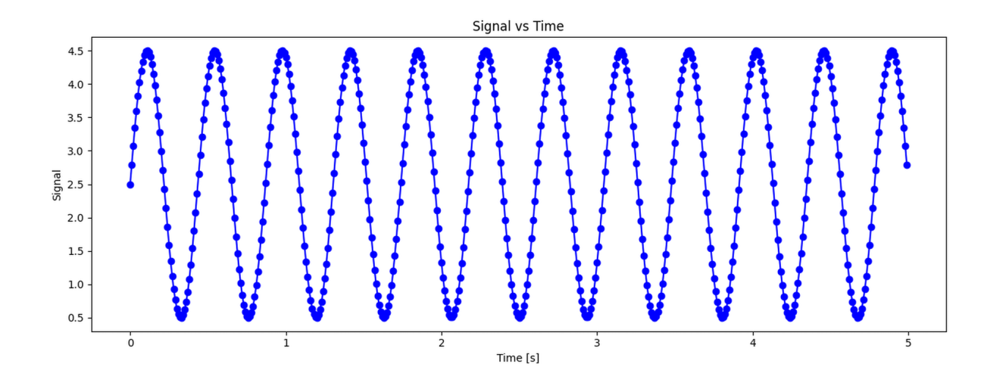
3. Finding sample rate:
```python
print("Sample rate: ",t.size/t[-1])
```
```terminal
Sample rate:  100.20040080160321
```
4. FFT data plots:
sigA:
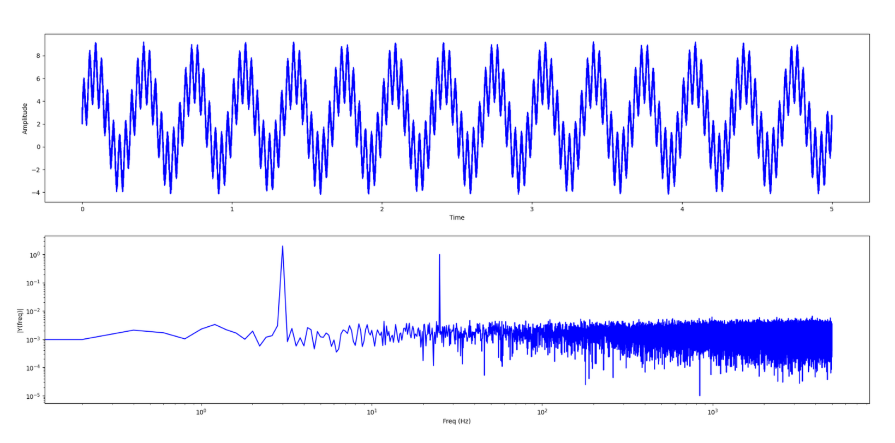
sigB:
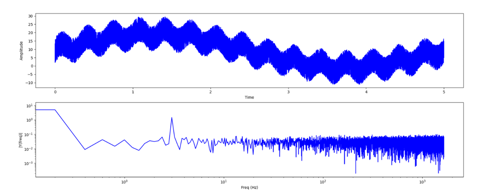
sigC:
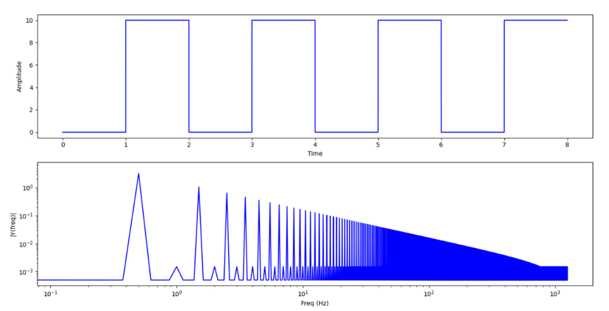
sigD:
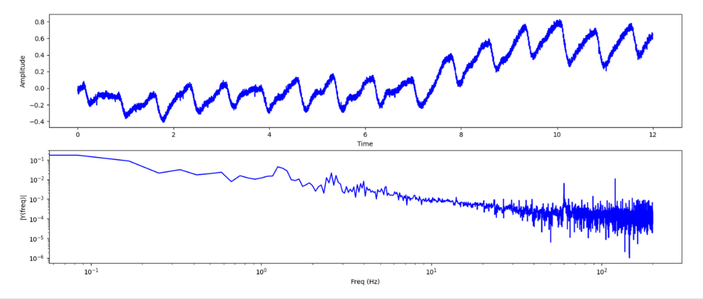
5.
Low pass filtering:

sigA (filter noise):
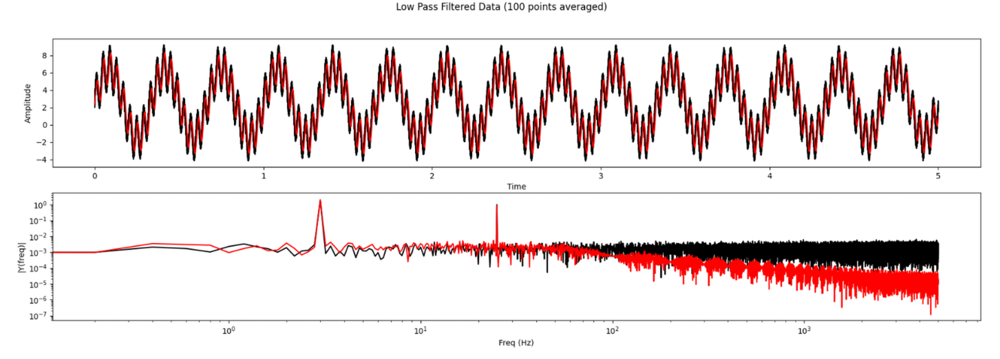
sigA (filter higher frequency signal) (very large lag):
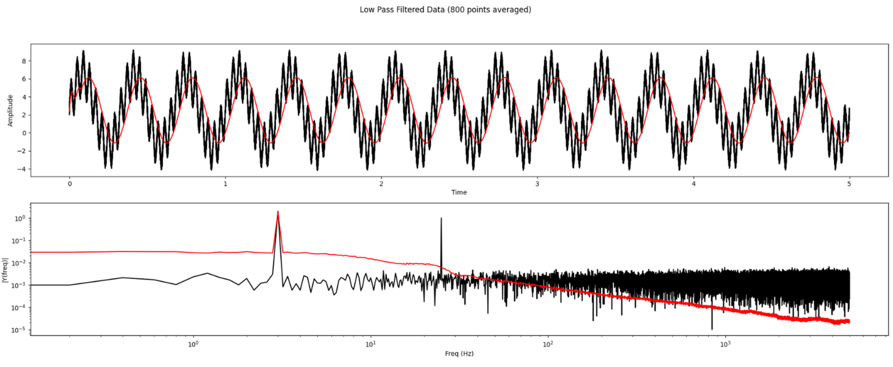
sigB (filter noise): 
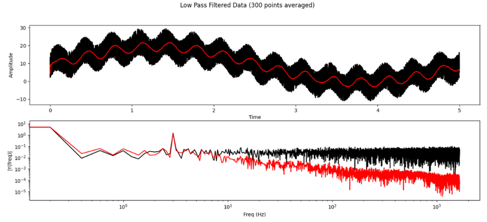
sigB (filter higher frequency signal):
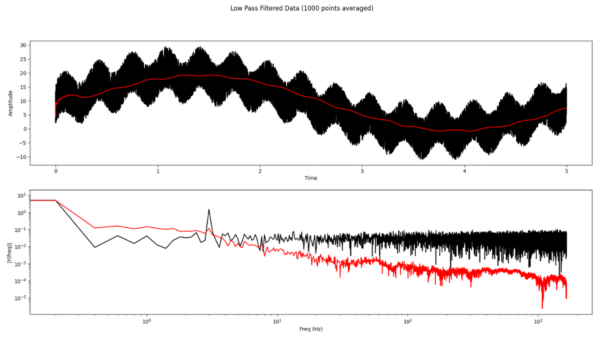
sigC (no noise):
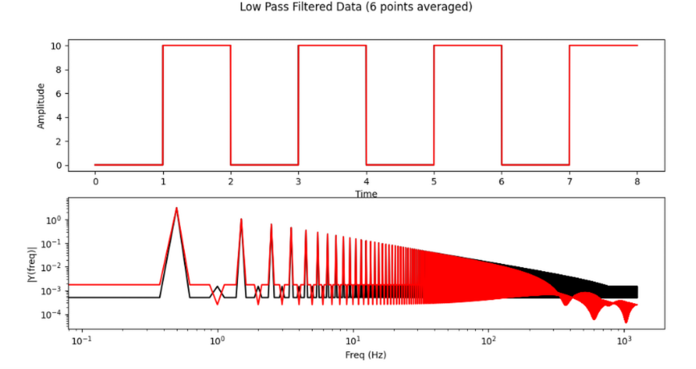
sigD:
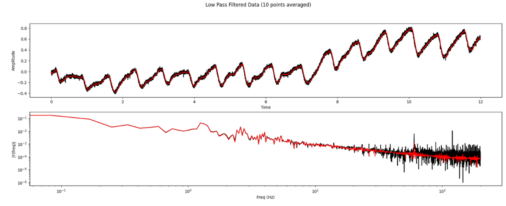

5.
IIR Filtering:


sigA:
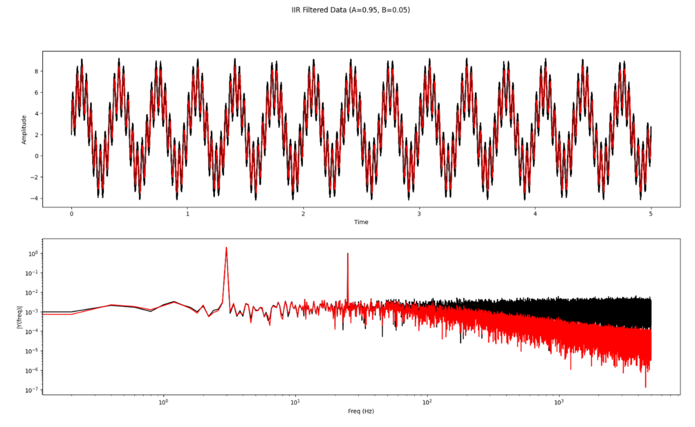
sigB: 
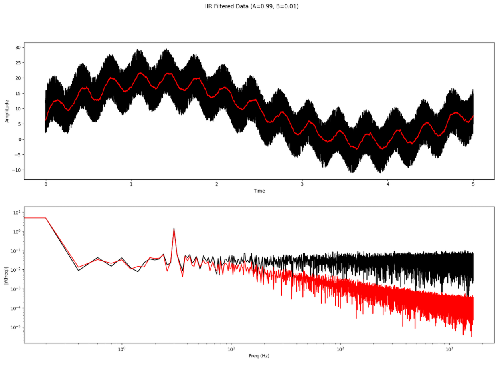
sigC:
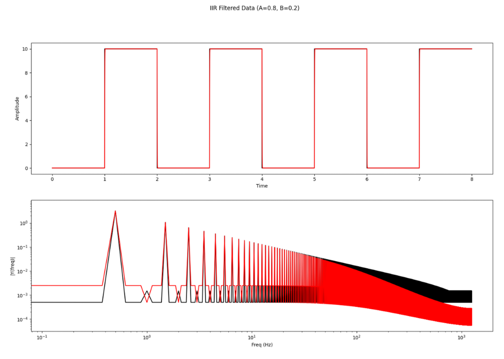
sigD:
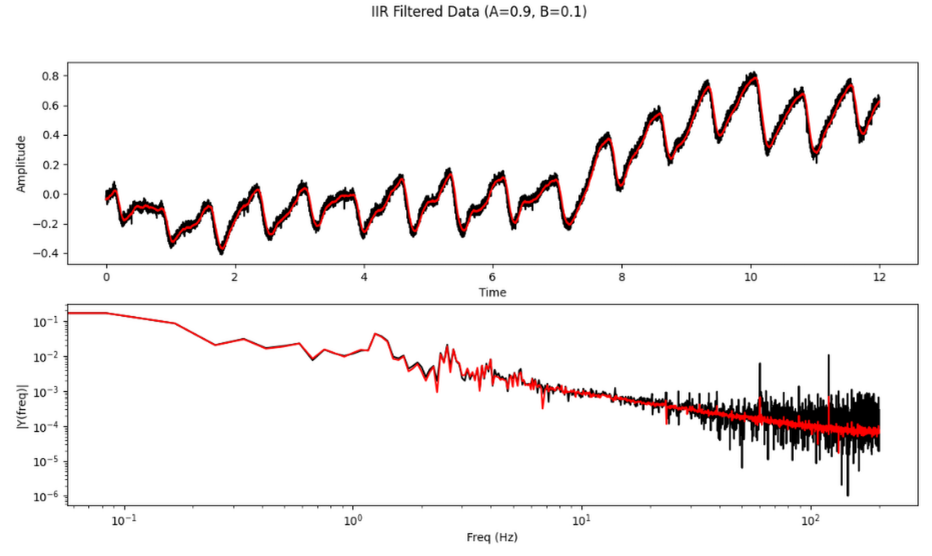

5.
FIR Filtering:

sigA:
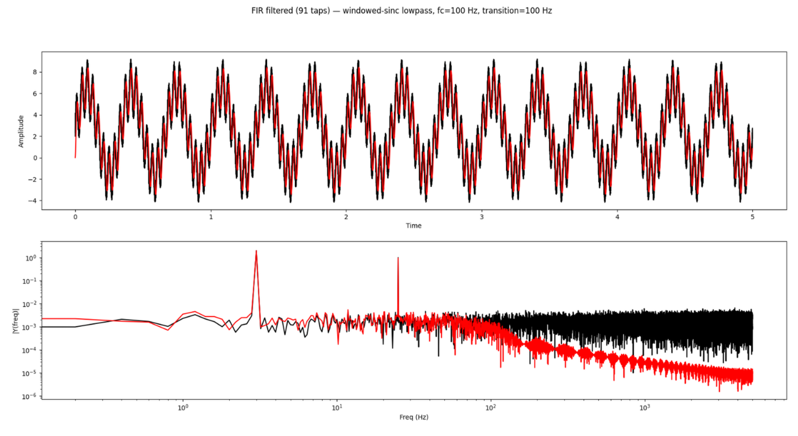
sigB: 
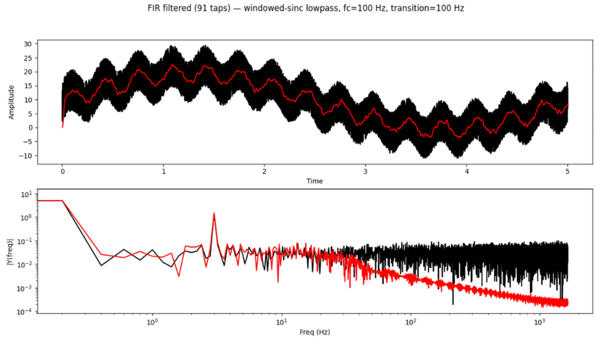
sigC:
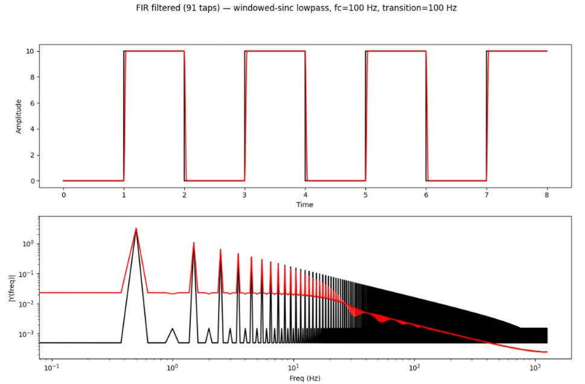
sigD:
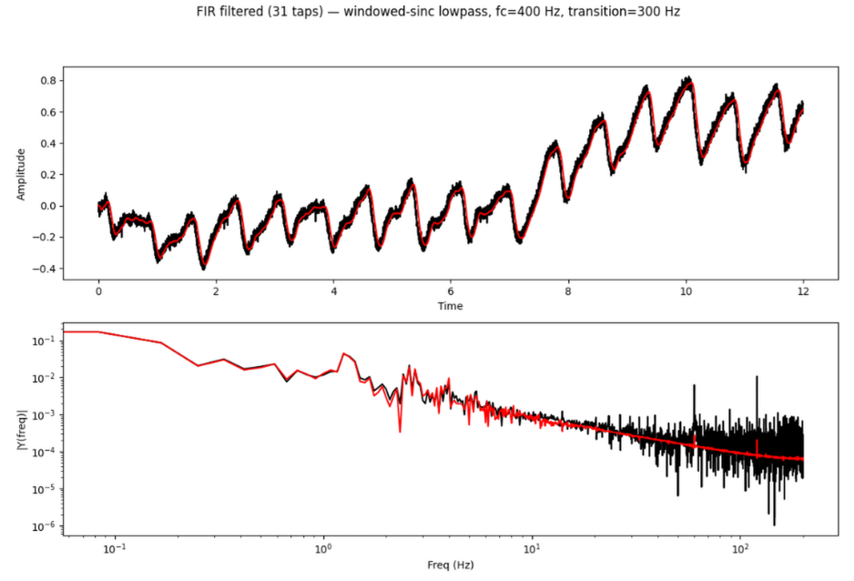
