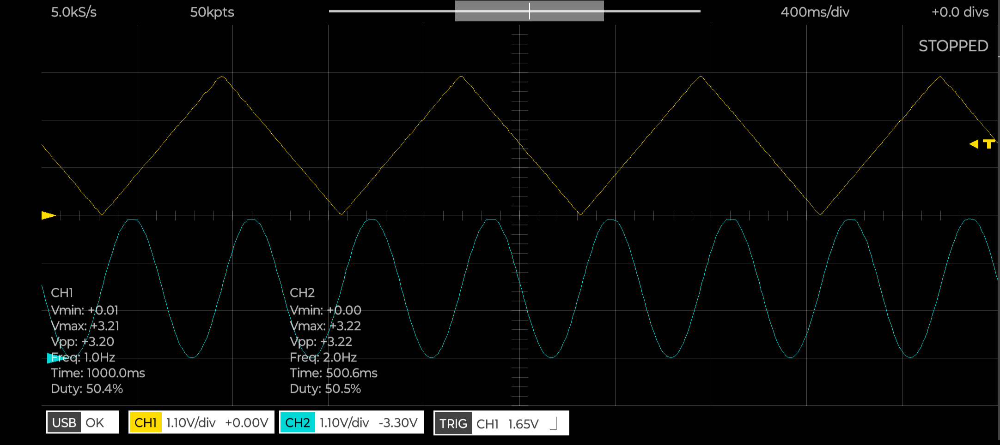
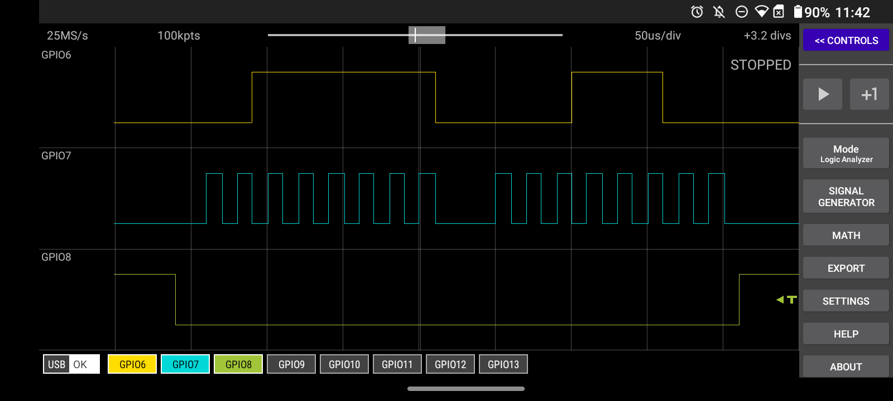

# SPI DAC
---

(I couldnt find any probes for the lab scopes)

Setting SPI baud to 50kS/sec, only updating DAC1, and analyzing signal:
GPIO6 - SPI Tx (yellow)
GPIO7 - SCK (blue)
GOIO8 - CS (green)

It looks like the sequence: 00111111 00011100 was sent
Meaning:
0 -> Write to DAC 0
0 -> Unbuffered
1 -> Gain 1x
1 -> Active mode
1111000111 -> 967/1023 = 3.12 V requested
00 -> bits ignored

From this, it looks like the SPI interface is working and sending the correct data as intended!